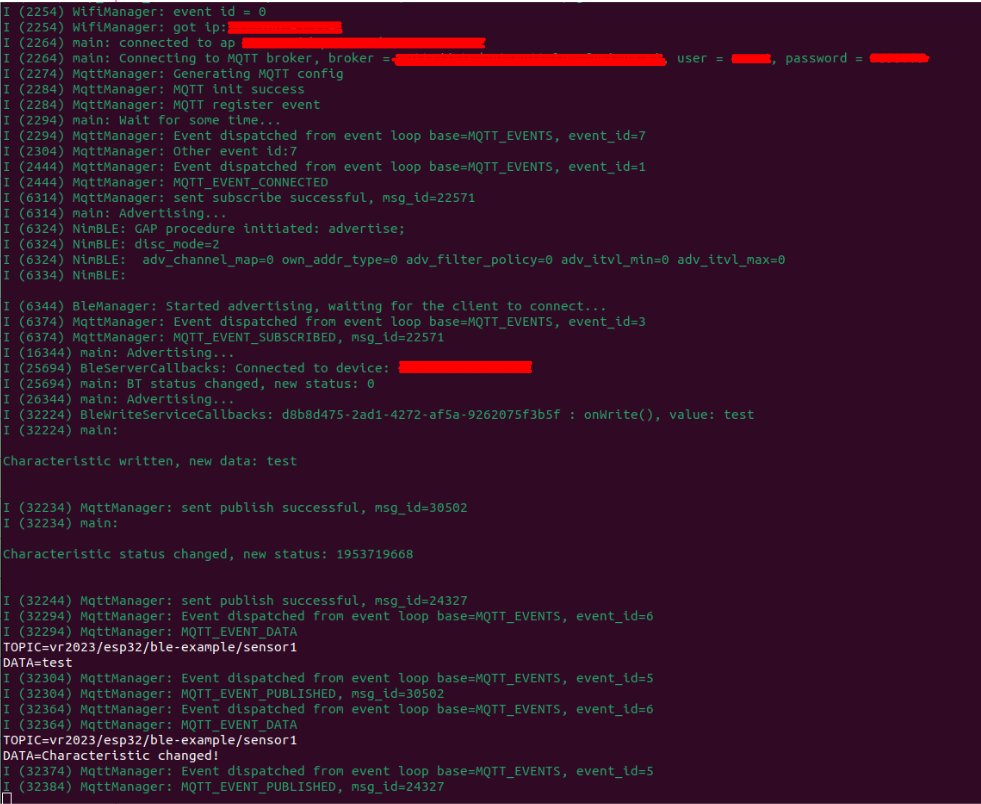

# esp32-ble-mqtt-demo

## Pre-run info

- When pulling the project, run (to pull dependent submodules - libraries):
  ```bash
  $ git submodule add -b release/1.3 https://github.com/h2zero/esp-nimble-cpp.git components/nimBLE
  ```

- Run `idf.py menuconfig` and check Bluetooth (BLE - NimBLE only) is selected (Component config -> Bluetooth (check) -> Bluetooth host -> NimBLE).

- Update secrets in `./main/Kconfig.projbuild`. 
  - to update the changes, run (if file `sdkconfig` exists) 
  ```bash
  $ mv sdkconfig sdkconfig.old
  $ idf.py fullclean
  $ idf.py build
  ``` 

## Used libraries

- [ESP-IDF v4.4](https://github.com/espressif/esp-idf/tree/release/v4.4)

- [NimBLE v1.3](https://github.com/h2zero/esp-nimble-cpp/tree/release/1.3)

## Useful tips

- If ESP32 (or JTAG adapter) is not recognized by computer on first run, modify udev rules:
  ```bash
  $ sudo gedit /etc/udev/rules.d/esp32-local.rules
  ```
  ```
  SUBSYSTEM=="usb", ATTRS{idVendor}=="0c45", ATTRS{idProduct}=="6366", OWNER="username", GROUP="plugdev", TAG+="uaccess"
  ```
  ```bash
  $ sudo adduser username plugdev
  $ sudo udevadm control --reload-rules
  ```

## Running the project

- Open console & ensure idf.py is available `idf.py`
  - If `idf.py` command is not found, source it from ESP-IDF, e.g. 
  ```bash
  $ . /path/to/esp-idf/export.sh
  ```
- Build the project 
  ```bash 
  $ idf.py build
  ```
- Run the project
  ```bash 
  $ idf.py -p /dev/ttyUSB0 -b 115200 flash
  ```
- Monitor its output using favourite tty, e.g.:
  ```bash
  $ idf.py monitor -p /dev/ttyUSB0
  or
  $ screen /dev/ttyUSB0 -b 115200
  ```
  - `idf.py monitor` [shortcuts](https://docs.espressif.com/projects/esp-idf/en/latest/esp32/api-guides/tools/idf-monitor.html)


## Demo

Console output from ESP32 on connecting and writing to a characteristic:


Monitor MQTT broker from [HiveMQ Client demo](https://www.hivemq.com/demos/websocket-client/).


## VSCode development

Useful .vscode files:

```json
// c_cpp_properties.json
{
    "configurations": [
        {
            "name": "ESP-IDF",
            "cStandard": "c11",
            "cppStandard": "c++17",
            "includePath": [
                "${config:idf.espIdfPath}/components/**",
                "${workspaceFolder}/**"
            ],
            "browse": {
                "path": [
                    "${config:idf.espIdfPath}/components",
                    "${workspaceFolder}"
                ],
                "limitSymbolsToIncludedHeaders": false
            },
            "compilerPath": "/usr/bin/gcc"
        }
    ],
    "version": 4
}
```

```json
// settings.json
// auto source /esp-idf/export.sh using splitTerminals extension
{
    "idf.adapterTargetName": "esp32",
    "restoreTerminals.terminals": [
        {
            "splitTerminals": [
                {
                    "name": "esp-idf",
                    "commands": ["get_idf"] // or something like $ . /path-to-esp-idf/export.sh
                }
            ]
        }
    ],
    "C_Cpp.errorSquiggles": "enabled",
}
```

## Debugging

For debugging purposes I was lucky enough to test JTAG adapter from [Neofoxx](https://github.com/Neofoxx/JTAG-SWD-adapter). To enable debugging, follow:

- Create file `.vscode/launch.json`
```json
// launch.json
{
    "version": "0.2.0",
    "configurations": [
        {
            "name": "ESP32 OpenOCD",
            "type": "cppdbg",
            "request": "launch",
            "program": "${workspaceFolder}/build/esp32-ble-mqtt-demo.elf", // change path specified to your needs
            "cwd": "${workspaceFolder}/build",
            "miDebuggerPath": "/path/to/esp-tools/tools/xtensa-esp32-elf/esp-2021r2-patch3-8.4.0/xtensa-esp32-elf/bin/xtensa-esp32-elf-gdb", // change to satisfy your needs
            "setupCommands": [
                { "text": "target remote 127.0.0.1:3333" },
                { "text": "set remote hardware-watchpoint-limit 2" }, // how many HW breakpoints MCU supports
                { "text": "monitor reset halt"}, // resets ESP32 and keeps it halted
                { "text": "flushregs"} // forces GDB to flush its internal register cache
            ]
        }
    ]
}
```

- run OpenOCD
```bash
$ openocd -f .....path-to-neofoxx-adapter/JTAG-SWD-adapter/Setup/neofoxx.cfg -c "transport select jtag" -f target/esp32.cfg -c "adapter_khz 1000"
```

- Click F5